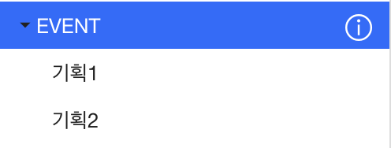
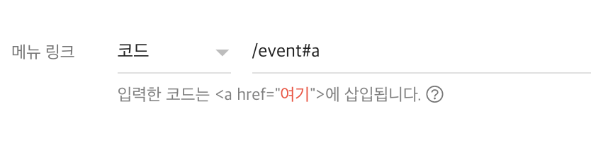
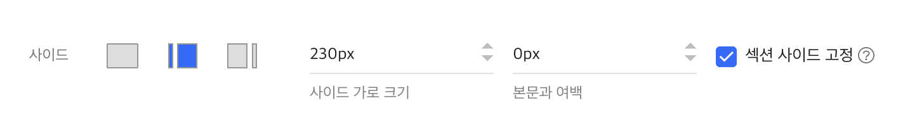

# 적용 방법

1. 진열하려는 상품을 기획전에 추가합니다.
   기획전이 하위카테고리로 들어가는 구조입니다.
2. 디자인 모드에서 메뉴를 구성합니다.예시: "EVENT" 메뉴의 하위에 "기획1", "기획2"
   
3. 하위 메뉴 설정에서 '메뉴 링크'를 '코드'로 선택하고 'event#a'와 같은 형식으로 입력합니다.
   해시 뒷부분에 하위 카테고리 이름을 영어로 적으시면 됩니다.
   하위 메뉴 모두 같은 설정을 해주세요.
   
4. 디자인모드에서 상위 메뉴 편집화면에 들어와서 하나의 섹션안에 구역을 나누고 기획전 위젯을 추가합니다.
5. 섹션 설정에서 섹션 사이드를 설정하고 "섹션 사이드 고정"에 체크합니다.
   
6. 디자인모드로 돌아와서 섹션 사이드에 메뉴/카테고리 위젯을 추가합니다.
7. 이제 섹션 내부에서 커스텀으로 구역 설정을 해야합니다. 임의의 id를 지정한 태그가 구역의 경계선이 됩니다. 방법은 두가지가 있습니다.
   - 방법1: 텍스트 위젯에 id 추가하기
     - 텍스트 위젯을 설정하려는 구역 맨 위에 추가합니다.
     - 텍스트를 더블클릭하여 편집모드를 열고 "코드보기"를 합니다.
     - p 태그 속성에 `id="singleroom-area-a"` 와 같이 id를 추가합니다.
   - 방법2: 코드 위젯에 빈 html 태그를 추가하기
     - 설정하려는 구역 맨위에 코드 위젯을 추가하고 `

` 와 같이 빈 div 태그에 id를 지정합니다.
8. 푸터 위에 작성한 JS, CSS 코드를 삽입합니다.
9. 코드에서 필요한 설정을 하고 저장합니다.

